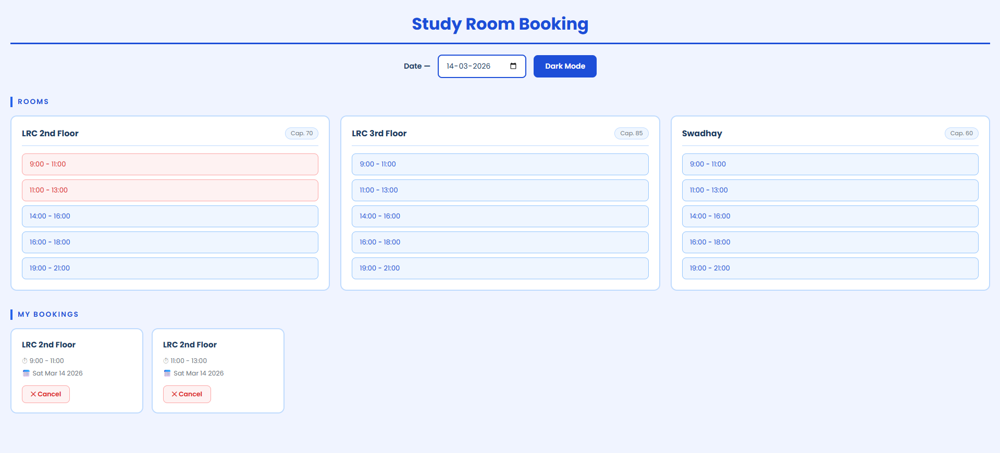

# Study Room Booking System

## Overview
The Study Room Booking System is a simple web application that allows users to book study rooms for specific time slots on a selected date. Users can view available rooms, reserve time slots, cancel bookings, and switch between light and dark mode.

The application is built using **HTML, CSS, and JavaScript** and stores booking data in the browser using **LocalStorage**, allowing bookings to persist even after refreshing the page.

## Features
- Select a date to view available study room slots
- Book available time slots
- Prevent double booking
- Cancel existing bookings
- Dark mode toggle
- Bookings saved using LocalStorage
- Simple and responsive interface

## How the System Works
1. The user selects a date using the date picker.
2. The system displays all study rooms and their available time slots.
3. If a slot is available, the user can click it to book the room.
4. Once booked, the slot becomes unavailable.
5. All bookings are listed in the **My Bookings** section.
6. Users can cancel bookings if needed.
7. Bookings are saved in LocalStorage so they remain after page refresh.

## File Description

### index.html
The main structure of the application.  
It contains the page layout including the title, date picker, dark mode button, rooms display section, and the bookings list. It also links the CSS and JavaScript files.

### style.css
Handles the visual appearance of the application.  
This includes layout design, room cards, slot styling, hover effects, and dark mode styling.

### script.js
Contains the main functionality of the application.  
This file manages room data, time slots, booking logic, canceling bookings, updating the interface dynamically, and storing bookings in LocalStorage.

## Technologies Used
- HTML
- CSS
- JavaScript
- Browser LocalStorage API

## Web Interface

 

 
